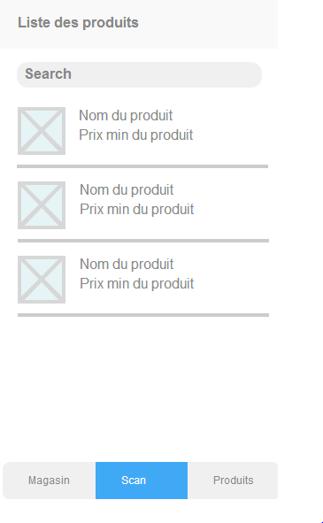
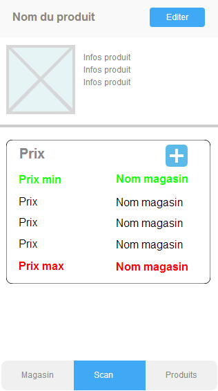
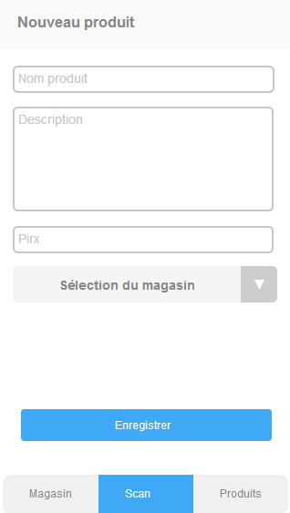
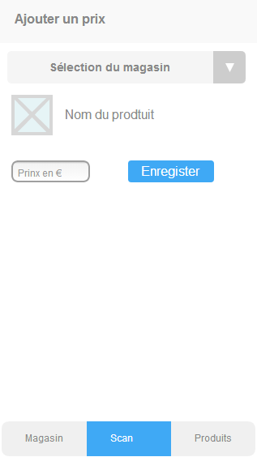
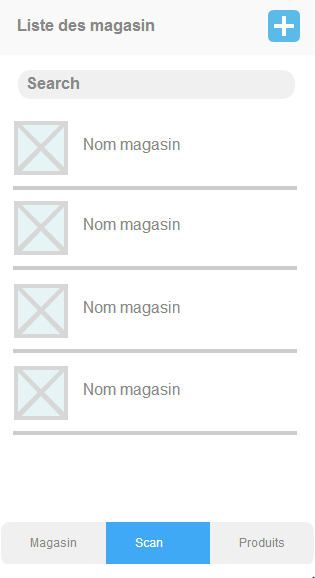
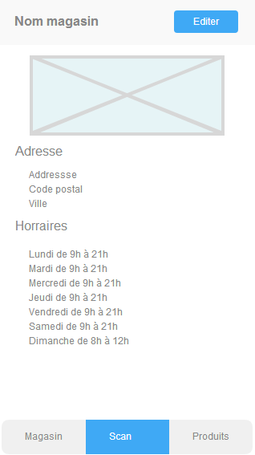
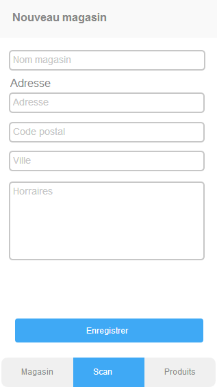

Ionic js
========

Intro
-----

Le but de ce projet est de créer une application collaborative de comparaison de prix pour savoir quel magasin est le moins cher avec ionicjs.

Requirements
------------

- NodeJs et npm
- Cordova
- Base en HTML / javascript et angularjs

Installation et création du projet
----------------------------------

Vous pouvez trouver la procédure d'installation et de création de projets [ici](http://ionicframework.com/getting-started/)

Pour ce tp, nous allons créer un projet de type tabs.

Etapes
------

### Etape 1 : la création des écrans ###

La première étape va être de créer les différents écrans de l'application.

L'application est décomposé en 3 onglets:

- Un onglet magasin qui va permettre de lister les différents magasins, voir le détail d'un magasin ou d'ajouter un nouveau magasin
- Un onglet scan qui va permettre de scanner un produit et d'afficher ses informations, ou proposer de le créer si le produit n'existe pas
- Un onglet produit qui va permettre de lister les différents produits et de les afficher en cliquant dessus.

L'application doit permettre de pouvoir gérer plusieurs prix par produit et par magasin.

Voici les mockups: 

#### Page produits ####

#### Détails produit ####

#### Ajout / Edition produit ####

#### Ajout prix ####

#### Page magasins ####

#### Détail magasin ####

#### Ajout magasin ####

### Intégration des webservices

Les webservices sont fourni par un Drupal. Le compte admin est:

- login:Ril12
- pass:ril12

#### Récupération des produits

Pour récupérer les produits, il faut appeler l'url suivante avec la méthode GET:

    http://romz.hd.free.fr/services/api/views/products.json

Vous pouvez filtrer sur le nom du produit ou sur son code bar en ajoutanten paramètre de l'url:
- name=Nomproduit
- barcode=uncodebar

Ex:

    http://romz.hd.free.fr/services/api/views/products.json?barcode=351545214

    http://romz.hd.free.fr/services/api/views/products.json?name="chips"

#### Récupération des magasins

Pour récupérer les magasins, il faut appeler l'url suivante avec la méthode GET:

    http://romz.hd.free.fr/services/api/views/stores.json

Vous pouvez filtrer sur le nom du magasin et la ville:

- name=nommagasin
- city=ville

Ex:

    http://romz.hd.free.fr/services/api/views/stores.json?name=Carrefour
	
    http://romz.hd.free.fr/services/api/views/stores.json?city=Rouen

#### Récupération des prix

Pour récupérer la liste des prix, il faut appeler l'url suivante avec la méthode GET:

    http://romz.hd.free.fr/services/api/views/prices.json

Vous pouvez filtrer sur le nid d'un produit ou sur le nid d'un magasin

- product=nidproduct
- store=nidstore

Ex:

    http://romz.hd.free.fr/services/api/views/prices.json?product=2
	
	http://romz.hd.free.fr/services/api/views/prices.json?store=1

#### Création d'un magasin:

    {
	  "title":"Nom du magasin",
	  "type":"store",
	  "field_address" : {
	    "und": [
          { "value":"Adresse magasin" }
        ]
      },
	  "field_zipcode": {
	    "und":[
	      { "value": "Code postal" }
        ]
	  },
	  "field_city":{
	    "und":[
	      { "value":"Ville" }
        ]
      },
	  "field_opening_hours": {
	    "und" : [
	      { "value": "Horraires" }
		]
	  }
	}

#### Création d'un produit

    {
	  "title":"Nom du produit",
	  "type":"product",
	  "field_barcode" : {
	    "und": [
          { "value":"Code bar du produit" }
        ]
      },
	  "field_description": {
	    "und":[
	      { "value": "Description du produit" }
        ]
	  }
	}

#### Création d'un prix

    {
	  "title":"Nom du prix",
	  "type":"price",
	  "field_product": {
        "und": <nid produit>
      }
	  "field_store": {
	    "und" : <nid store>
	  }
	  "field_price": {
	    "und" : [
          {value: "prix produit"}
        ]
	  }
	}

#### Ajout d'une image

    var input = document.getElementById('id_input_file');
	if(input.files.length > 0) {
	  var reader = new FileReader();
	  var file = input.files[0];

      reader.onloadend = function(e) { //Action a effectuer quand le fichier a fini d'être charger
	    var filemime = e.target.result.split(';')[0].split(':')[1];
		var photo = e.target.result.split(';')[1].split(',')[1];
		var params = {
		  filesize: file.size,
		  filename: file.name,
		  file: photo,
		  filemime:filemime
		};

        //Appeler l'url http://romz.hd.free.fr/services/api/file en poste avec en datas params
       
	  }
	}

Resources
---------

### Ionic:

[Headers](http://ionicframework.com/docs/api/directive/ionHeaderBar/)
[Tabs](http://ionicframework.com/docs/api/directive/ionTabs/)
[Vues](http://ionicframework.com/docs/api/directive/ionNavView/)
[Listes](http://ionicframework.com/docs/api/directive/ionList/)
[Icons](http://ionicons.com/)

### Angular

[Filtres](https://docs.angularjs.org/api/ng/filter/filter)
[Ajax](https://docs.angularjs.org/api/ng/service/$http)
[ngRepeat](https://docs.angularjs.org/api/ng/directive/ngRepeat)
[ngModel](https://docs.angularjs.org/api/ng/directive/ngModel)
[ngClass](https://docs.angularjs.org/api/ng/directive/ngClass)
[ngBindHtml](https://docs.angularjs.org/api/ng/directive/ngBindHtml)
[ngOptions](https://docs.angularjs.org/api/ng/directive/select)
[States](https://github.com/angular-ui/ui-router)

Bonus
-----

Pour le menu des nouvelles pages, on pourra faire un side menu:
[Side menu](http://ionicframework.com/docs/api/directive/ionSideMenus/)

### Système de favoris

Gérer un système de favoris sur les produits en en stoquant les nids des produits dans une [base de donnée sqlite](http://www.lafermeduweb.net/billet/html5sql-js-utilisez-du-sql-cote-client-avec-les-html5-web-database-1277.html) ou avec le [localstorage](http://www.lafermeduweb.net/billet/le-stockage-local-en-html5-localstorage-942.html)
- Ajouter une entré de menu dans le side menu
- Créer une nouvelle page qui liste les produits mis en favoris
- Ajouter un bouton dans les pages produits pour mettre en favoris
- Ajouter un [delete button](http://ionicframework.com/docs/api/directive/ionDeleteButton/) sur la liste des favoris

### Gestion des cartes de fidélités

Ajouter la possibilité à l'utilisateur de renseigner des cartes de fidélité

- Ajouter une entré de menu dans le side menu
- Créer une page qui liste les cartes de fidélités (lien + nom de la carte + bouton d'ajout de carte)
- Ajouter bouton pour scanner les cartes de fidélité
- Quand la carte de fidélité est scanée, rediriger vers la page pour lui assigner un nom (champs texte + bouton de sauvegare)
- Gérer les carte en localstorage ou en sqlite

### Géolocalisation

Ajouter une gestion de la géolocalisation pour n'afficher que les prix des magasins aux alentour. (Utilisation de google maps api)

### Gestion des catégories

Ajouter la possibilité de gérer des catégories de produits (Fruits et légumes, high-tech etc)

### Liste de courses

Ajouter la possibilité de créer une liste de course en scanant les produits.
